# Bank of Baku — Strategic Branch & Transit Intelligence Report

> - **Audience:** Executive leadership, Strategy, Retail Network Planning
> - **Data scope:** 585 bank branches across 20 banks, 3,834 bus stops, 208 bus routes in Azerbaijan
> - **Focus:** Bank of Baku (BOB) competitive positioning, public transit accessibility, and expansion opportunities

---

## Executive Summary

Bank of Baku operates **21 branches** — ranking **9th out of 20 banks** in network size. The market leader, Kapital Bank, operates 177 branches (8.4x larger). Despite the smaller footprint, BOB's existing branches are **exceptionally well-positioned for public transit access**, outperforming Kapital Bank and most competitors on walkability metrics. This creates a clear strategic narrative: **BOB doesn't need to match competitors on quantity — but it must be surgical about where it places each branch.**

This report identifies 76 high-value expansion locations, reveals which BOB branches face the heaviest competitive pressure, and quantifies the transit accessibility advantage BOB currently holds.

---

## 1. Market Position: BOB's Branch Network Is Small but Focused

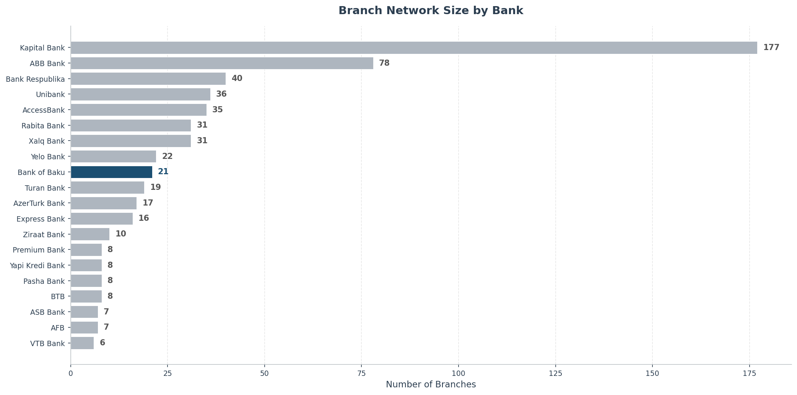

**What this shows:** The number of physical branches operated by each bank in Azerbaijan.

**Why it matters:** BOB's 21 branches place it in the lower half of the market. Kapital Bank dominates with 177 branches, followed by ABB (78) and Bank Respublika (40). BOB has fewer branches than Unibank (36), AccessBank (35), Rabita Bank (31), and Xalq Bank (31).

**Business implication:** With a smaller network, every branch location must deliver maximum customer reach. Poor placement is more costly for BOB than for larger competitors who can afford redundancy. This makes data-driven site selection critical.

---

## 2. Geographic Distribution: BOB Is Concentrated in Baku Center

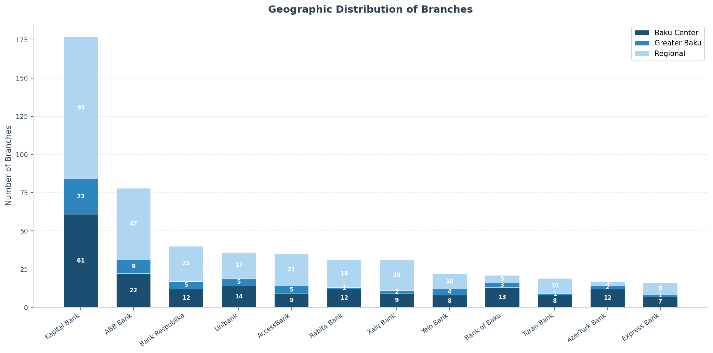

**What this shows:** Where each bank's branches are located — split between Baku Center, Greater Baku suburbs, and regional cities across Azerbaijan.

**Why it matters:** BOB has 16 branches in the Baku area and only 5 in regional cities. Competitors like Kapital Bank (177 branches) and ABB (78) have built significant regional footprints across the country. BOB's regional presence is limited to a handful of strategic cities.

**Business implication:** If BOB's growth strategy involves geographic expansion beyond Baku, the gap is substantial. However, if the strategy is Baku-centric density, the current concentration makes sense — but only if branches are optimally placed within the capital.

---

## 3. Geographic Mix: How BOB Compares to the Top 5

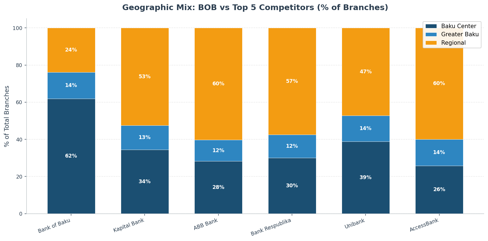

**What this shows:** The percentage breakdown of each bank's branches across Baku Center, Greater Baku, and Regional locations.

**Why it matters:** BOB has the **highest concentration in Baku Center** relative to its total network compared to most top competitors. This is a deliberate urban-core strategy. Kapital Bank and ABB spread their networks much more broadly across regions, which means they capture customers in smaller cities and towns where BOB is absent.

**Business implication:** BOB's Baku-heavy strategy makes it more dependent on Baku's competitive dynamics. If a new competitor targets Baku center aggressively, BOB has less geographic diversification to fall back on.

---

## 4. Transit Accessibility: BOB's Strongest Competitive Advantage

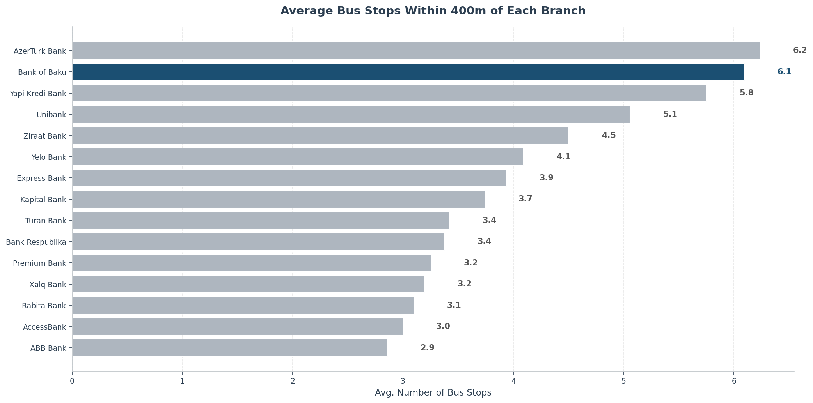

**What this shows:** The average number of bus stops within a 400m walk (roughly 5 minutes) of each bank's branches.

**Why it matters:** BOB branches average **6.1 bus stops within walking distance** — ranking among the top performers in the market. The market leader Kapital Bank averages only 3.7 stops per branch. This means BOB customers arriving by public transport have better access to BOB branches than to many competitor branches.

**Business implication:** BOB's branch placement strategy has — intentionally or not — optimized for public transit access. This is a significant advantage in a market where a large share of retail banking customers rely on buses. This advantage should be protected and replicated in new locations.

---

## 5. Bus Route Connectivity: How Many Routes Serve Each Bank's Branches

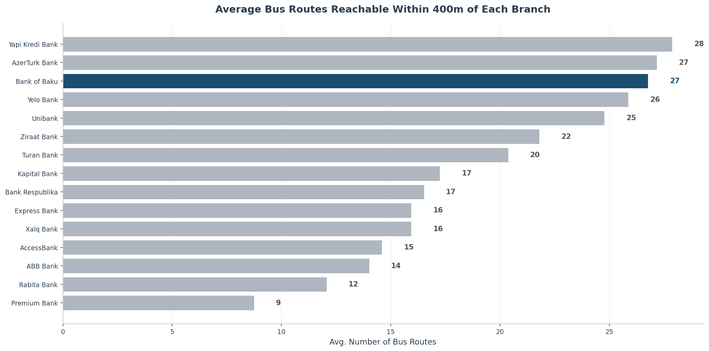

**What this shows:** The average number of distinct bus routes passing within walking distance of each bank's branches.

**Why it matters:** BOB branches are reachable via an average of **26.8 bus routes** — significantly ahead of Kapital Bank (17.2 routes) and most other competitors. This means customers from many different parts of the city can reach a BOB branch with a single bus ride, without transfers.

**Business implication:** High route connectivity translates directly to a larger catchment area per branch. A customer who lives on any of 27 different bus routes can reach a BOB branch directly. This partially compensates for BOB's smaller network — each branch effectively "serves" a wider geographic area.

---

## 6. Transport Hub Proximity: How Close Are Branches to Major Transit Hubs

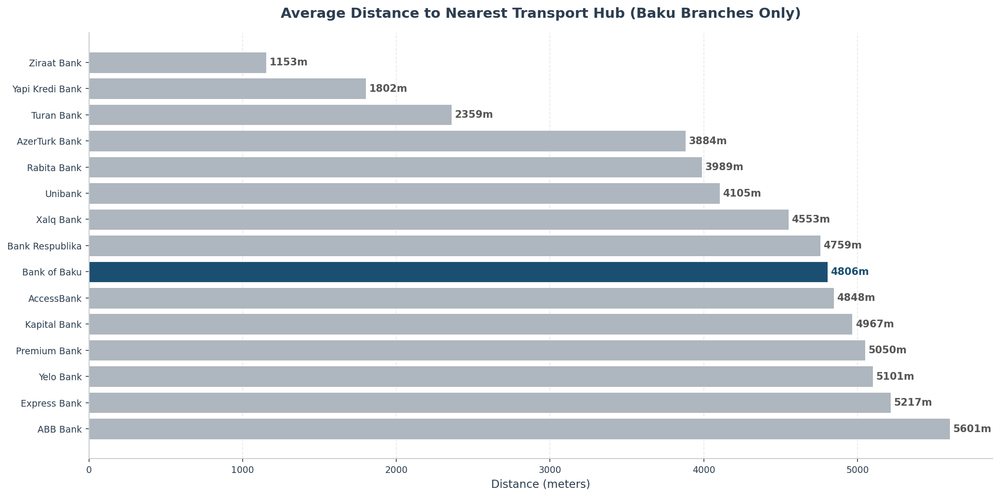

**What this shows:** The average distance from each bank's Baku-area branches to the nearest major transport hub (29 designated hubs where multiple bus routes converge).

**Why it matters:** Branches near transport hubs benefit from the highest foot traffic and the easiest customer access. BOB's performance on this metric indicates how strategically branches are placed relative to major transit intersections.

**Business implication:** Transport hubs are premium real estate for branch placement. Any future BOB branch should ideally be within 500m of a hub. Branches far from hubs should be evaluated for relocation potential.

---

## 7. BOB Branch-Level Scorecard: Not All Branches Are Equal

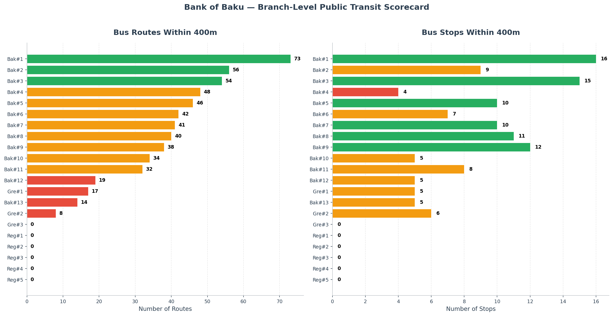

**What this shows:** A branch-by-branch breakdown of transit accessibility for all 21 BOB locations. The left panel shows bus routes within walking distance; the right shows bus stops within walking distance. Colors indicate performance: green (strong), orange (moderate), red (weak).

**Key findings:**
- BOB's **Baku Center branches** (labeled "Bak#") generally score well, with several locations having 40+ bus routes nearby
- Some branches in **Greater Baku** and **Regional** locations have very low connectivity — under 5 bus routes
- The regional branches naturally score lower since the bus network data covers the Baku metropolitan system

**Business implication:** The Baku Center branches are well-positioned. The weaker branches in the suburbs should be assessed: are they serving communities that primarily use cars (in which case transit matters less), or are they in transit-dependent areas but poorly placed relative to bus routes?

---

## 8. Expansion Opportunities: 76 High-Value Locations Without BOB

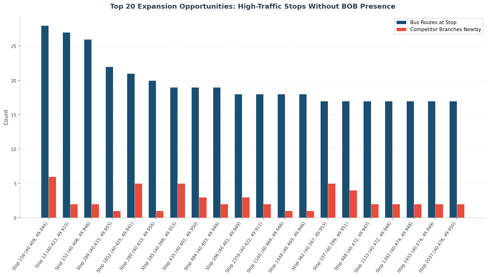

**What this shows:** The top 20 bus stop locations where (a) 10 or more bus routes converge, (b) competitor bank branches exist nearby, but (c) BOB has no branch within 600 meters. These are validated demand locations where customers already visit and competitors already operate — but BOB is absent.

**Why it matters:** These are not speculative locations. The combination of high transit traffic and existing competitor presence confirms customer demand. BOB is leaving these customers to competitors.

**Business implication:** This is a prioritized shortlist for new branch evaluation. The stops with the highest route counts and most competitor branches nearby represent the strongest expansion candidates. **76 such locations were identified in total** — a substantial pipeline for the network planning team.

---

## 9. Competitive Pressure on Existing BOB Branches

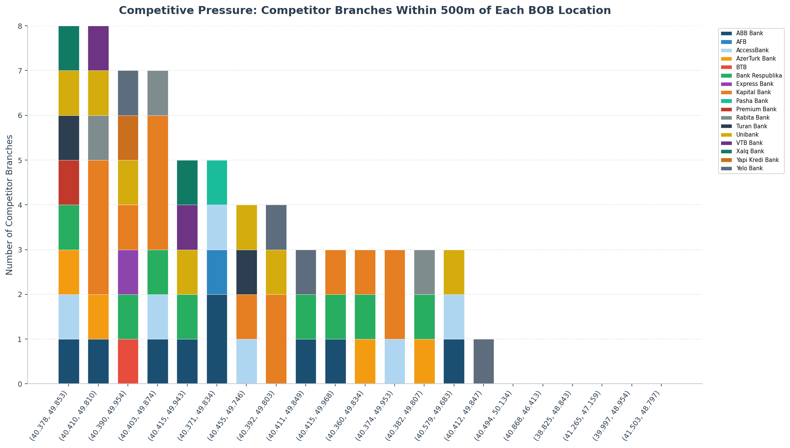

**What this shows:** For each of BOB's 21 branches, how many competitor branches operate within 500 meters — broken down by bank.

**Key findings:**
- Several BOB branches in Baku Center face **intense competitive pressure**, with 10+ competitor branches within 500m
- Kapital Bank, ABB, AzerTurk Bank, and Bank Respublika are the most frequent neighbors
- A few BOB branches (in suburbs and regions) face almost no nearby competition

**Business implication:** High-competition branches need differentiation — better service, extended hours, or specialized products. Low-competition branches may represent blue-ocean opportunities where BOB is the default choice for nearby residents.

---

## 10. Nearest Bus Stop: How Walkable Are Branches

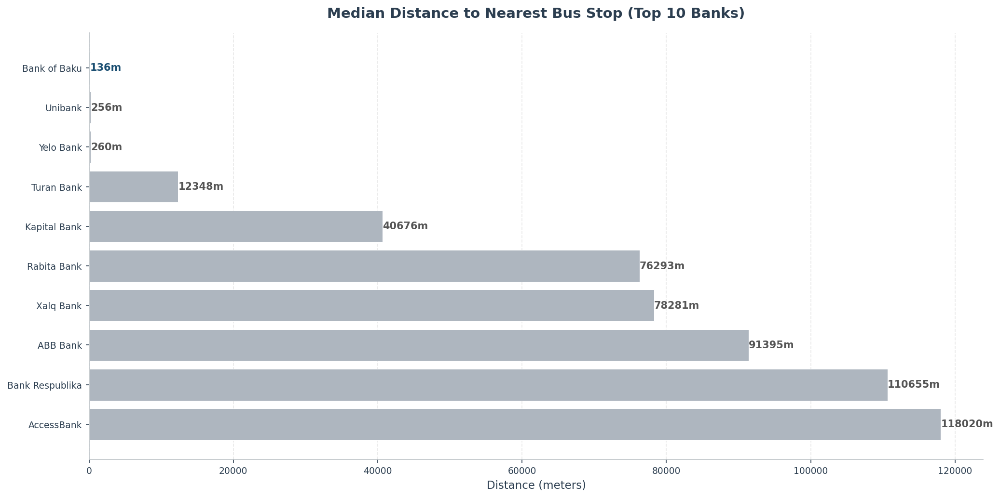

**What this shows:** The median distance from each bank's branches to the closest bus stop.

**Why it matters:** A shorter distance to the nearest bus stop means customers can step off a bus and walk into the branch within minutes. This is a direct measure of convenience for transit-dependent customers.

**Business implication:** BOB should ensure all future branches are within 200m of a bus stop. Any existing branch more than 300m from the nearest stop should be flagged for review.

---

## 11. Baku Center Grid: Where Transit Density Outpaces BOB Presence


**What this shows:** Baku's central area divided into a 5x5 grid. The three heatmaps show: (1) bus stop density per cell, (2) competitor branch density, and (3) BOB branch density.

**Key findings:**
- **9 grid cells** have significant transit infrastructure and competitor branches but **zero BOB presence**
- The highest transit-density cells are in the mid-central and southern parts of Baku center
- BOB's branches are clustered in a few cells, leaving large transit-rich zones uncovered

**Business implication:** This is a visual gap analysis. The white/empty cells on the BOB heatmap that show high numbers on the transit and competitor heatmaps are immediate areas of interest for network expansion planning.

---

## 12. Head-to-Head: BOB vs Kapital Bank

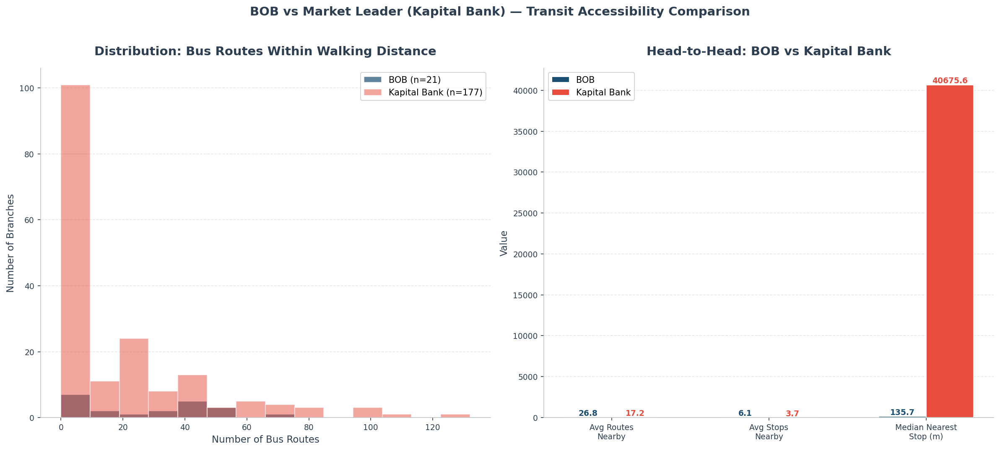

**What this shows:** A direct comparison between BOB and the market leader (Kapital Bank) on transit accessibility metrics.

**Key findings:**
- BOB outperforms Kapital Bank on **average routes nearby** (26.8 vs 17.2) and **average stops nearby** (6.1 vs 3.7)
- Kapital Bank's large network includes many branches in low-transit areas (regional, suburban)
- BOB's focused Baku strategy results in higher per-branch transit scores

**Business implication:** When competing against Kapital Bank's scale, BOB's advantage is accessibility quality. Marketing can position BOB branches as "easy to reach by bus" — a practical, everyday message that resonates with transit-using customers. This is a genuine, data-backed differentiator.

---

## 13. Network Size vs Transit Quality: Where Banks Sit

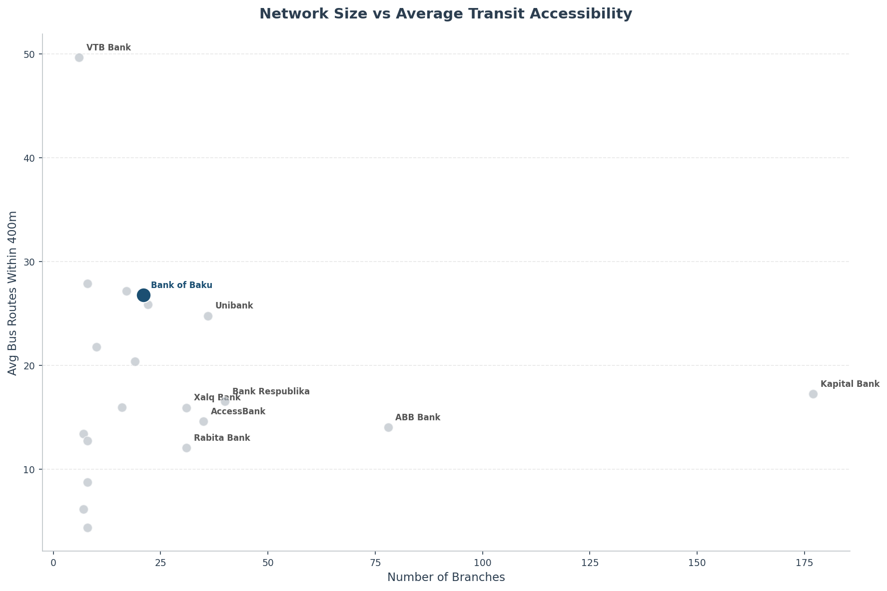

**What this shows:** Each bank plotted by network size (horizontal) versus average transit accessibility (vertical). BOB appears as the highlighted point.

**Key findings:**
- BOB sits in a favorable quadrant: moderate network size but **above-average transit accessibility**
- Banks with large networks (Kapital, ABB) tend to have lower average accessibility because their regional branches dilute the score
- Small banks with Baku-only presence tend to cluster with BOB on accessibility

**Business implication:** As BOB grows its network, it must be deliberate about maintaining transit accessibility quality. Expanding into low-transit suburban or regional areas will pull the average down. Each new branch should meet a minimum transit-accessibility threshold.

---

## 14. Baku vs Regional: The Geographic Divide

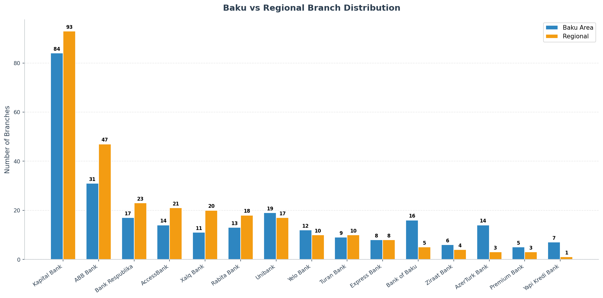

**What this shows:** For the top 15 banks, how many branches are in the Baku area versus regional cities.

**Why it matters:** Kapital Bank has massive regional presence. ABB, Bank Respublika, Xalq Bank, and Rabita Bank also maintain significant regional networks. BOB's 5 regional branches represent a minimal footprint outside the capital.

**Business implication:** If BOB decides to expand regionally, the investment required is significant — not just branches, but regional marketing, staffing, and operations. The alternative is to double down on Baku density and digital channels for regional customers.

---

## 15. Who Competes Most Directly with BOB

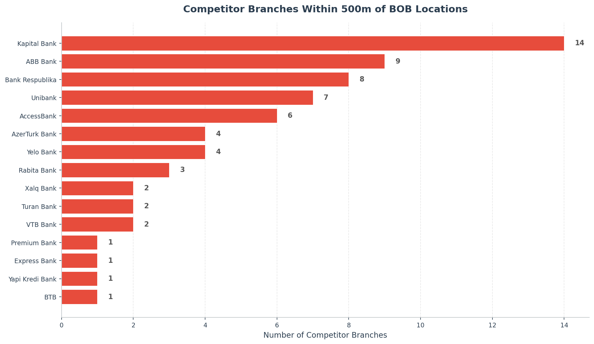

**What this shows:** Which competitor banks have the most branches within 500m of any BOB location. This reveals who BOB's most direct, location-based competitors are.

**Key findings:**
- **Kapital Bank** and **ABB** have the most branches near BOB locations — they are BOB's primary geographic competitors
- **AzerTurk Bank**, **Bank Respublika**, and **Rabita Bank** also compete directly at multiple BOB locations
- Smaller banks like Pasha Bank and Ziraat Bank have minimal overlap with BOB

**Business implication:** Competitive intelligence and differentiation efforts should focus primarily on Kapital Bank and ABB, as they are most likely to compete for the same walk-in customers at the same locations.

---

## 16. Transit-Poor Branches: Who Has Blind Spots

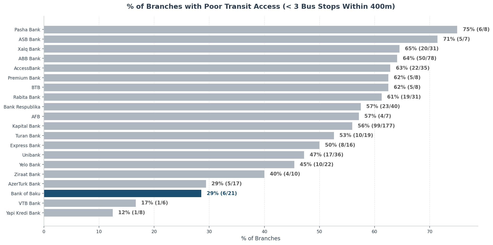

**What this shows:** The percentage of each bank's branches that have fewer than 3 bus stops within walking distance — indicating poor public transit access.

**Why it matters:** Branches with poor transit access depend on customers arriving by car or deliberate trip-making. In a city like Baku where bus ridership is significant, this limits the branch's walk-in customer potential.

**Business implication:** BOB should audit any branches that fall into this category. If poor-transit branches also show low foot traffic or transaction volumes, they may be candidates for relocation to transit-rich locations identified in this report.

---

## Strategic Recommendations

Based on this analysis, the following actions are recommended for Bank of Baku leadership:

### Immediate Actions
1. **Evaluate the top 20 expansion locations** identified in Chart 8 — these are data-validated sites with high transit traffic and proven competitor demand
2. **Audit low-scoring BOB branches** (Chart 7, red indicators) for foot traffic and transaction volume to determine if relocation is warranted
3. **Set a transit-accessibility threshold** for all future branch site selections — minimum 5 bus stops and 15 bus routes within 400m

### Strategic Initiatives
4. **Leverage the transit advantage in marketing** — BOB branches are measurably more accessible by bus than the market leader. This is a real, everyday benefit for customers
5. **Consider the Baku Center grid gaps** (Chart 11) as the first priority for network densification — these are zones where customers exist, competitors profit, and BOB is absent
6. **Monitor Kapital Bank and ABB competitive moves** — they are BOB's most direct geographic competitors (Chart 15)

### Long-Term Planning
7. **Decide the regional strategy** — BOB is heavily Baku-concentrated. Either invest in regional expansion (costly, infrastructure-heavy) or explicitly pursue a digital-first model for regional customers
8. **Maintain transit quality during growth** — as the network expands, track average transit accessibility (Chart 13) to ensure new branches don't dilute BOB's positioning advantage

---

## Data Sources

| Dataset | Records | Description |
|---------|---------|-------------|
| Bank Branches | 585 | Branch locations for 20 banks across Azerbaijan |
| Bus Stops | 3,834 | All public transport stops with coordinates |
| Bus Routes | 208 | Complete route data including stop sequences and connectivity |

---

## How to Regenerate Charts

```bash
python scripts/generate_charts.py
```

All charts will be saved to the `charts/` directory.
